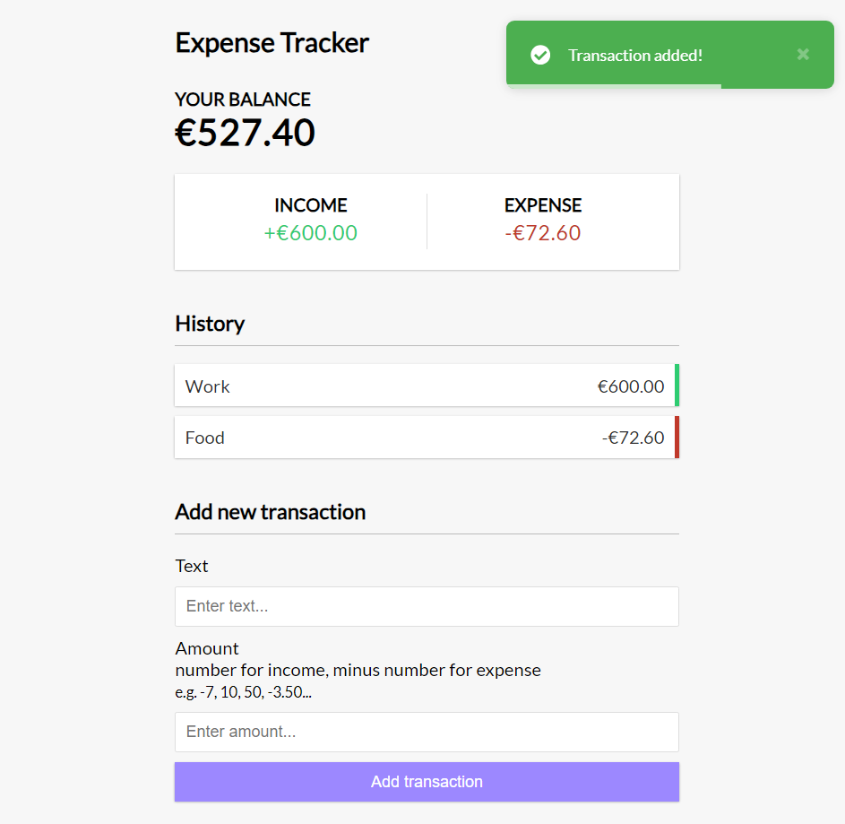

# Expense Tracker

Expense Tracker App built with Vue 3 and the composition API.

- Add and remove expenses/income
- Track balance
- Save data to local storage
- [Vue Toastification](https://github.com/Maronato/vue-toastification) for notifications
- `<script setup>` syntax (Vue 3.2+)

Demo: https://idyllic-moxie-56a1b2.netlify.app/
